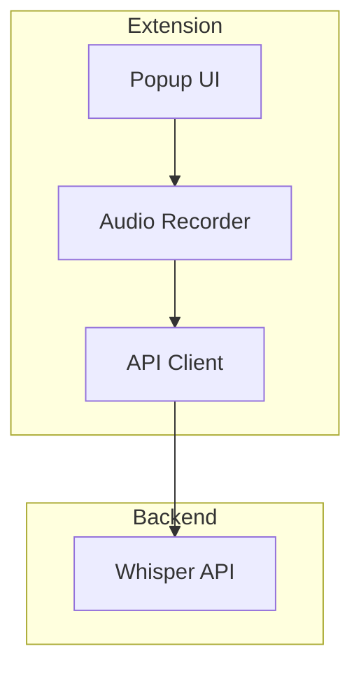

# WhisperWit Chrome Extension MVP

## Core Features

### 1. Basic Speech-to-Text
- Record audio with hotkey
- Transcribe using Whisper API
- Insert text into active field
- Basic error handling

### 2. Simple UI
- Record button
- Status indicator
- Basic settings
- Error messages

### 3. Essential Settings
- API key input
- Language selection
- Hotkey configuration
- Basic preferences

## Simplified Architecture

## MVP Components

### 1. Extension
- manifest.json
- popup.html
- background.js
- content.js
- styles.css

### 2. Features
- Audio recording
- Text insertion
- Basic settings
- Error handling

### 3. API Integration
- Direct Whisper API calls
- Simple authentication
- Basic error handling

## 4-Week Timeline

### Week 1: Setup
- Create extension structure
- Implement audio recording
- Add basic UI

### Week 2: Core Function
- Integrate Whisper API
- Add text insertion
- Basic error handling

### Week 3: Polish
- Add settings
- Improve UI
- Basic testing

### Week 4: Launch
- Testing
- Documentation
- Store submission

## Success Metrics
- Working transcription
- < 3 second response
- Basic error handling
- User feedback

## Launch Steps
1. Test extension
2. Create store listing
3. Submit to Chrome Store
4. Gather user feedback

Would you like me to start with the basic extension structure?